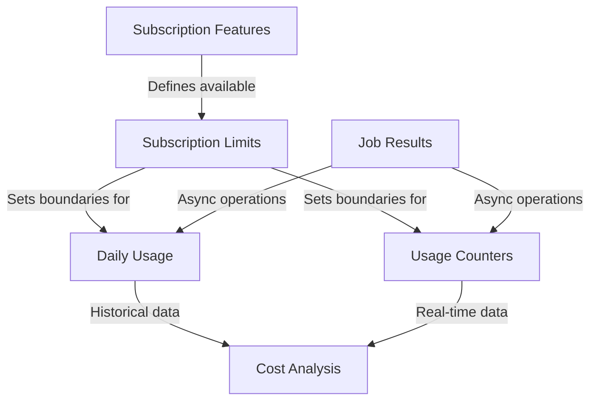

# Monitoring Usage Resources

This comprehensive guide covers all monitoring usage resources in the DatoCMS Content Management API. These resources help you track resource consumption, monitor plan limits, and analyze usage patterns to optimize your application and manage costs effectively.

## Table of Contents

- [Overview](#overview)
- [Installation](#installation)
- [Daily Usage](#daily-usage)
- [Job Results](#job-results)
- [Subscription Features](#subscription-features)
- [Subscription Limits](#subscription-limits)
- [Usage Counters](#usage-counters)
- [Cross-Resource Examples](#cross-resource-examples)

## Overview

DatoCMS provides comprehensive usage monitoring through five main resources:

1. **Daily Usage**: Historical usage statistics aggregated by day
2. **Job Results**: Status and results of asynchronous operations
3. **Subscription Features**: Available features based on your plan
4. **Subscription Limits**: Real-time limit tracking and consumption
5. **Usage Counters**: Granular, per-occurrence metrics updated every minute

These resources work together to provide:
- Complete visibility into resource consumption
- Proactive limit monitoring and alerts
- Cost optimization insights
- Performance analysis capabilities
- Capacity planning data
- Usage trend analysis

### Resource Relationships



## Installation

```bash
npm install @datocms/cma-client
```

```typescript
import { buildClient } from '@datocms/cma-client';

const client = buildClient({ apiToken: 'YOUR_API_TOKEN' });
```

---

# Daily Usage

The DailyUsage resource provides access to daily usage statistics for your DatoCMS project, including API calls, traffic, and media usage metrics. This data is essential for monitoring resource consumption, managing costs, and capacity planning.

## Overview

Daily usage data includes:
- API call counts (CDA and CMA)
- Bandwidth usage (CDN and API traffic)
- Media processing metrics (video encoding/streaming)
- Build minutes consumed
- Asset storage and transformations

## Available Operations

### List Daily Usage

```javascript
const usages = await client.dailyUsages.list();
```

**Returns:** An array of DailyUsage objects containing usage statistics for each day

## The DailyUsage Object

```typescript
{
  id: string;                                    // Unique identifier
  type: 'daily_usage';                          // Always 'daily_usage'
  date: string;                                 // Date in ISO format (YYYY-MM-DD)
  cda_api_calls: number;                        // Content Delivery API calls count
  cma_api_calls: number;                        // Content Management API calls count
  cda_traffic_bytes: number;                    // Content Delivery API traffic in bytes
  cma_traffic_bytes: number;                    // Content Management API traffic in bytes
  assets_traffic_bytes: number;                 // Upload/asset traffic in bytes
  mux_delivered_seconds: number;                // Video streaming (≤1080p) in seconds
  mux_high_resolution_delivered_seconds: number; // High-res video streaming (>1080p)
  mux_encoded_seconds: number;                  // Video encoding time in seconds
}
```

## Common Use Cases

### 1. Monitor API Usage Trends

```javascript
const usages = await client.dailyUsages.list();

// Calculate total API calls for the period
const totalCalls = usages.reduce((sum, day) => 
  sum + day.cda_api_calls + day.cma_api_calls, 0
);

// Find peak usage day
const peakDay = usages.reduce((max, day) => 
  (day.cda_api_calls + day.cma_api_calls) > (max.cda_api_calls + max.cma_api_calls) ? day : max
);

console.log(`Total API calls: ${totalCalls}`);
console.log(`Peak usage on ${peakDay.date}: ${peakDay.cda_api_calls + peakDay.cma_api_calls} calls`);
```

### 2. Calculate Bandwidth Usage

```javascript
const usages = await client.dailyUsages.list();

// Calculate total bandwidth in GB
const totalBandwidthBytes = usages.reduce((sum, day) => 
  sum + day.cda_traffic_bytes + day.cma_traffic_bytes + day.assets_traffic_bytes, 0
);

const totalBandwidthGB = (totalBandwidthBytes / (1024 * 1024 * 1024)).toFixed(2);

console.log(`Total bandwidth used: ${totalBandwidthGB} GB`);

// Breakdown by service
usages.forEach(day => {
  const cdaGB = (day.cda_traffic_bytes / (1024 * 1024 * 1024)).toFixed(2);
  const cmaGB = (day.cma_traffic_bytes / (1024 * 1024 * 1024)).toFixed(2);
  const assetsGB = (day.assets_traffic_bytes / (1024 * 1024 * 1024)).toFixed(2);
  
  console.log(`${day.date}: CDA: ${cdaGB}GB, CMA: ${cmaGB}GB, Assets: ${assetsGB}GB`);
});
```

### 3. Cost Monitoring Dashboard

```javascript
// Create a usage report for the current month
const usages = await client.dailyUsages.list();
const currentMonth = new Date().toISOString().substring(0, 7);

const monthlyUsage = usages
  .filter(day => day.date.startsWith(currentMonth))
  .reduce((report, day) => {
    report.apiCalls += day.cda_api_calls + day.cma_api_calls;
    report.bandwidth += day.cda_traffic_bytes + day.cma_traffic_bytes + day.assets_traffic_bytes;
    report.videoStreaming += day.mux_delivered_seconds + day.mux_high_resolution_delivered_seconds;
    report.videoEncoding += day.mux_encoded_seconds;
    return report;
  }, { apiCalls: 0, bandwidth: 0, videoStreaming: 0, videoEncoding: 0 });

console.log('Monthly Usage Report:', {
  apiCalls: monthlyUsage.apiCalls.toLocaleString(),
  bandwidthGB: (monthlyUsage.bandwidth / (1024**3)).toFixed(2),
  videoStreamingHours: (monthlyUsage.videoStreaming / 3600).toFixed(2),
  videoEncodingMinutes: (monthlyUsage.videoEncoding / 60).toFixed(2)
});
```

---

# Job Results

The JobResult resource allows you to retrieve the results of asynchronous operations in DatoCMS. When you perform bulk operations or long-running tasks, the API returns a job ID immediately, allowing you to check the status and retrieve results asynchronously.

## Overview

Job results are used for:
- Bulk create/update/delete operations
- Import/export operations
- Schema migrations
- Content validations
- Media processing tasks

## Available Operations

### Find a Job Result

```javascript
const jobResult = await client.jobResults.find(jobId);
```

**Parameters:**
- `jobId` (string, required): The ID of the job result to retrieve

**Returns:** A JobResult object containing the operation status and payload

## The JobResult Object

```typescript
{
  id: string;                    // The job result ID
  type: 'job_result';           // Always 'job_result'
  status: number;               // HTTP status code (200 = success)
  payload: null | {             // Operation results (varies by job type)
    [k: string]: unknown;
  };
}
```

## Common Use Cases

### 1. Bulk Operations

```javascript
// Initiate bulk operation
const job = await client.items.bulkCreate({
  items: [
    { item_type: { type: 'item_type', id: '123' }, title: 'Item 1' },
    { item_type: { type: 'item_type', id: '123' }, title: 'Item 2' }
  ]
});

// The client automatically polls for results, but you can check manually:
const result = await client.jobResults.find(job.id);

if (result.status === 200) {
  console.log('Created items:', result.payload);
} else {
  console.error('Operation failed:', result.payload);
}
```

### 2. Real-time Job Monitoring

```javascript
import { jobResultsFetcher } from '@datocms/cma-client';

// Set up real-time monitoring
const { data, error } = await jobResultsFetcher({
  apiToken: client.config.apiToken,
  jobId: job.id
});

if (data) {
  console.log('Job completed:', data);
} else {
  console.error('Job failed:', error);
}
```

---

# Subscription Features

The SubscriptionFeature resource provides information about which features are available and in use for your DatoCMS project based on its subscription plan. While SubscriptionLimit tracks quantitative usage (how much), SubscriptionFeature tracks qualitative capabilities (what features are enabled).

## Overview

Subscription features include:
- Authentication & security features (SSO, 2FA, IP whitelist)
- Development & testing capabilities (sandbox environments, draft API)
- Publishing workflows and scheduling
- Analytics and monitoring tools
- API and integration features
- Advanced media management

## Available Operations

### List All Subscription Features

```javascript
const features = await client.subscriptionFeatures.list();
```

**Returns:** An array of all subscription features for your project

## The SubscriptionFeature Object

```typescript
{
  id: string;                    // Feature identifier (same as code)
  type: 'subscription_feature';  // Always 'subscription_feature'
  code: string;                  // The feature codename
  enabled: boolean;              // Whether available on current plan
  in_use?: boolean;             // Whether actively used (optional)
}
```

## Common Feature Types

### Authentication & Security
| Feature Code | Description |
|--------------|-------------|
| `sso` | Single Sign-On integration |
| `two_factor_authentication` | Two-factor authentication |
| `ip_whitelist` | IP address whitelisting |

### Development & Testing
| Feature Code | Description |
|--------------|-------------|
| `sandbox_environments` | Multiple sandbox environments |
| `draft_content_api` | Access draft content via API |
| `environment_fork` | Fork environments |

### Publishing & Workflows
| Feature Code | Description |
|--------------|-------------|
| `scheduled_publishing` | Schedule content publication |
| `workflows` | Publishing workflows |
| `bulk_publish` | Bulk publish operations |

## Common Use Cases

### Feature Availability Check

```javascript
// Check if specific features are available
async function checkFeatureAvailability(client, requiredFeatures) {
  const features = await client.subscriptionFeatures.list();
  const featureMap = new Map(features.map(f => [f.code, f]));
  
  const results = requiredFeatures.map(featureCode => {
    const feature = featureMap.get(featureCode);
    return {
      feature: featureCode,
      available: feature?.enabled || false,
      inUse: feature?.in_use || false
    };
  });
  
  const unavailable = results.filter(r => !r.available);
  
  if (unavailable.length > 0) {
    console.warn('Unavailable features:', unavailable.map(r => r.feature));
  }
  
  return results;
}

// Usage
const required = ['sso', 'sandbox_environments', 'webhooks'];
const availability = await checkFeatureAvailability(client, required);
```

---

# Subscription Limits

The SubscriptionLimit resource provides real-time information about your DatoCMS project's plan limits and current usage. This is essential for monitoring resource consumption, implementing usage warnings, and ensuring your application respects plan constraints.

## Overview

Subscription limits track:
- API usage limits (calls per month)
- Storage and bandwidth quotas
- Content limits (items, models, locales)
- User and access restrictions
- Feature-specific limits

## Available Operations

### List All Subscription Limits

```javascript
const limits = await client.subscriptionLimits.list();
```

**Returns:** An array of all subscription limits for your project

### Find Specific Subscription Limit

```javascript
const limit = await client.subscriptionLimits.find(limitId);
```

**Parameters:**
- `limitId` (string, required): The limit identifier (e.g., 'api_calls', 'storage_bytes')

**Returns:** A single SubscriptionLimit object

## The SubscriptionLimit Object

```typescript
{
  id: string;                    // The limit identifier
  type: 'subscription_limit';    // Always 'subscription_limit'
  code: string;                  // The limit code/name
  usage: number;                 // Current usage amount
  limit: number | null;          // Maximum allowed (null = unlimited)
}
```

## Common Limit Types

### API Usage Limits
| Limit Code | Description | Reset Period |
|------------|-------------|--------------||
| `api_calls` | Total API calls | Monthly |
| `cda_api_calls` | Content Delivery API calls | Monthly |
| `cma_api_calls` | Content Management API calls | Monthly |

### Storage & Bandwidth
| Limit Code | Description | Type |
|------------|-------------|------|
| `storage_bytes` | Total storage used | Cumulative |
| `bandwidth_bytes` | Monthly bandwidth | Monthly |
| `upload_size_bytes` | Max file upload size | Per file |

### Content Limits
| Limit Code | Description | Type |
|------------|-------------|------|
| `items_count` | Total content items | Cumulative |
| `item_types_count` | Number of models | Cumulative |
| `locales_count` | Number of locales | Cumulative |
| `environments_count` | Sandbox environments | Cumulative |

## Common Use Cases

### Usage Dashboard

```javascript
// Create a comprehensive usage report
const limits = await client.subscriptionLimits.list();

const dashboard = limits.map(limit => {
  const percentage = limit.limit 
    ? Math.round((limit.usage / limit.limit) * 100)
    : null;
  
  return {
    resource: limit.code.replace(/_/g, ' ').replace(/\b\w/g, l => l.toUpperCase()),
    usage: limit.usage.toLocaleString(),
    limit: limit.limit ? limit.limit.toLocaleString() : 'Unlimited',
    utilization: percentage !== null ? `${percentage}%` : '-',
    status: percentage > 90 ? '🔴' : percentage > 75 ? '🟡' : '🟢'
  };
});

console.table(dashboard);
```

### Pre-flight Validation

```javascript
// Check limits before bulk operations
async function canCreateItems(client, count) {
  const itemsLimit = await client.subscriptionLimits.find('items_count');
  
  if (!itemsLimit.limit) {
    return { canCreate: true, message: 'No item limit' };
  }
  
  const remaining = itemsLimit.limit - itemsLimit.usage;
  
  if (count > remaining) {
    return {
      canCreate: false,
      message: `Cannot create ${count} items. Only ${remaining} slots available.`
    };
  }
  
  return {
    canCreate: true,
    message: `Creating ${count} items (${remaining - count} will remain)`
  };
}
```

---

# Usage Counters

The UsageCounter resource provides real-time, granular analytics for tracking API usage and resource consumption in your DatoCMS project. Unlike daily aggregated statistics, usage counters offer per-occurrence metrics updated every minute, making them ideal for debugging, optimization, and real-time monitoring.

## Overview

Usage counters provide:
- Per-endpoint API usage tracking
- Per-IP address monitoring
- Asset bandwidth analysis
- Access token usage patterns
- Video streaming metrics
- Real-time abuse detection

## Available Operations

### Find Usage Counter

```javascript
const counter = await client.usageCounters.find(counterId, queryParams);
```

**Parameters:**
- `counterId` (string, required): The type of counter to retrieve
- `queryParams` (object, optional):
  - `period`: Time period filter - `'today'`, `'current_month'`, or `'last_month'`

**Returns:** A UsageCounter object with occurrence counts

## The UsageCounter Object

```typescript
{
  id: string;                // The counter type
  type: 'usage_counter';     // Always 'usage_counter'
  result: Array<{
    value: string;           // The specific occurrence (IP, path, user ID, etc.)
    counter: number;         // Count for that occurrence
  }>
}
```

## Counter Types

### Asset Usage Counters
| Counter ID | Description | Value Type |
|------------|-------------|------------|
| `assets_path_bytes` | Bytes transferred per asset path | Asset path |
| `assets_referrer_bytes` | Bytes transferred per referrer | Referrer URL |
| `assets_ip_bytes` | Bytes transferred per IP | IP address |
| `assets_full_path_bytes` | Bytes per full asset path | Full asset URL |
| `assets_path_requests` | Requests per asset path | Asset path |
| `assets_full_path_requests` | Requests per full path | Full asset URL |

### Content Delivery API (CDA) Counters
| Counter ID | Description | Value Type |
|------------|-------------|------------|
| `cda_access_token_id_bytes` | Bytes per access token | Access token ID |
| `cda_access_token_id_requests` | Requests per access token | Access token ID |
| `cda_referrer_bytes` | Bytes per referrer | Referrer URL |
| `cda_referrer_requests` | Requests per referrer | Referrer URL |
| `cda_ip_bytes` | Bytes per IP address | IP address |
| `cda_ip_requests` | Requests per IP address | IP address |

### Content Management API (CMA) Counters
| Counter ID | Description | Value Type |
|------------|-------------|------------|
| `cma_endpoint_bytes` | Bytes per API endpoint | Endpoint path |
| `cma_endpoint_requests` | Requests per API endpoint | Endpoint path |
| `cma_user_bytes` | Bytes per user | User ID |
| `cma_user_requests` | Requests per user | User ID |
| `cma_ip_bytes` | Bytes per IP address | IP address |
| `cma_ip_requests` | Requests per IP address | IP address |

### Video Usage Counter
| Counter ID | Description | Value Type |
|------------|-------------|------------|
| `video_path_seconds` | Streaming seconds per video | Video path |

## Common Use Cases

### Debug API Quota Issues

```javascript
// Find which IPs are making the most CMA requests today
const ipRequests = await client.usageCounters.find('cma_ip_requests', {
  period: 'today'
});

// Sort by highest usage
const topOffenders = ipRequests.result
  .sort((a, b) => b.counter - a.counter)
  .slice(0, 10);

console.log('Top 10 IPs by request count:');
topOffenders.forEach(({ value, counter }) => {
  console.log(`${value}: ${counter.toLocaleString()} requests`);
});
```

### Real-time Abuse Detection

```javascript
// Check for potential abuse patterns
async function detectAbusePatterns() {
  // Check IP request patterns
  const ipRequests = await client.usageCounters.find('cma_ip_requests', {
    period: 'today'
  });
  
  const THRESHOLD = 10000; // Daily request threshold per IP
  
  const suspiciousIPs = ipRequests.result
    .filter(({ counter }) => counter > THRESHOLD)
    .sort((a, b) => b.counter - a.counter);
  
  if (suspiciousIPs.length > 0) {
    console.warn('⚠️ Suspicious activity detected:');
    suspiciousIPs.forEach(({ value, counter }) => {
      console.warn(`IP ${value}: ${counter.toLocaleString()} requests today`);
    });
  }
  
  return suspiciousIPs;
}
```

---

# Cross-Resource Examples

These examples demonstrate how to use multiple monitoring usage resources together for comprehensive analysis and monitoring.

## Complete Usage Analysis Dashboard

```javascript
import { buildClient } from '@datocms/cma-client';

const client = buildClient({ apiToken: 'YOUR_API_TOKEN' });

async function generateComprehensiveReport() {
  // Fetch all monitoring data in parallel
  const [
    features,
    limits,
    dailyUsages,
    apiCounter,
    assetCounter
  ] = await Promise.all([
    client.subscriptionFeatures.list(),
    client.subscriptionLimits.list(),
    client.dailyUsages.list(),
    client.usageCounters.find('cma_endpoint_requests', { period: 'current_month' }),
    client.usageCounters.find('assets_path_bytes', { period: 'current_month' })
  ]);
  
  // Analyze features
  const enabledFeatures = features.filter(f => f.enabled);
  const unusedFeatures = enabledFeatures.filter(f => f.in_use === false);
  
  // Analyze limits
  const criticalLimits = limits.filter(l => {
    if (!l.limit) return false;
    const usage = (l.usage / l.limit) * 100;
    return usage > 80;
  });
  
  // Calculate daily averages
  const currentMonth = new Date().toISOString().substring(0, 7);
  const monthlyData = dailyUsages.filter(d => d.date.startsWith(currentMonth));
  
  const avgDaily = monthlyData.length > 0 ? {
    apiCalls: monthlyData.reduce((sum, d) => sum + d.cda_api_calls + d.cma_api_calls, 0) / monthlyData.length,
    bandwidth: monthlyData.reduce((sum, d) => sum + d.cda_traffic_bytes + d.cma_traffic_bytes + d.assets_traffic_bytes, 0) / monthlyData.length
  } : { apiCalls: 0, bandwidth: 0 };
  
  // Identify top API consumers
  const topEndpoints = apiCounter.result
    .sort((a, b) => b.counter - a.counter)
    .slice(0, 5);
  
  const topAssets = assetCounter.result
    .sort((a, b) => b.counter - a.counter)
    .slice(0, 5)
    .map(a => ({ path: a.value, bandwidth: (a.counter / 1024 / 1024 / 1024).toFixed(2) + ' GB' }));
  
  return {
    plan: {
      totalFeatures: features.length,
      enabledFeatures: enabledFeatures.length,
      unusedFeatures: unusedFeatures.length,
      criticalLimits: criticalLimits.map(l => ({
        resource: l.code,
        usage: `${Math.round((l.usage / l.limit) * 100)}%`,
        remaining: l.limit - l.usage
      }))
    },
    usage: {
      dailyAverages: {
        apiCalls: Math.round(avgDaily.apiCalls),
        bandwidthMB: Math.round(avgDaily.bandwidth / 1024 / 1024)
      },
      topEndpoints,
      topAssets
    },
    recommendations: generateRecommendations(criticalLimits, unusedFeatures)
  };
}

function generateRecommendations(criticalLimits, unusedFeatures) {
  const recommendations = [];
  
  if (criticalLimits.length > 0) {
    recommendations.push({
      type: 'warning',
      message: `${criticalLimits.length} resources are approaching their limits`,
      action: 'Consider upgrading your plan or optimizing usage'
    });
  }
  
  if (unusedFeatures.length > 3) {
    recommendations.push({
      type: 'info',
      message: `You have ${unusedFeatures.length} unused features available`,
      action: 'Explore these features to get more value from your plan'
    });
  }
  
  return recommendations;
}

// Generate and display report
const report = await generateComprehensiveReport();
console.log(JSON.stringify(report, null, 2));
```

## Predictive Monitoring System

```javascript
async function setupPredictiveMonitoring() {
  // Get historical data and current limits
  const [dailyUsages, limits] = await Promise.all([
    client.dailyUsages.list(),
    client.subscriptionLimits.list()
  ]);
  
  // Calculate growth trends
  const currentMonth = new Date().toISOString().substring(0, 7);
  const lastMonth = new Date(new Date().setMonth(new Date().getMonth() - 1)).toISOString().substring(0, 7);
  
  const currentMonthData = dailyUsages.filter(d => d.date.startsWith(currentMonth));
  const lastMonthData = dailyUsages.filter(d => d.date.startsWith(lastMonth));
  
  // Project end-of-month usage
  const daysInMonth = new Date(new Date().getFullYear(), new Date().getMonth() + 1, 0).getDate();
  const daysElapsed = new Date().getDate();
  
  const projections = limits.map(limit => {
    if (!limit.limit) return null;
    
    // Find corresponding daily usage metric
    let currentTotal = 0;
    if (limit.code === 'api_calls') {
      currentTotal = currentMonthData.reduce((sum, d) => sum + d.cda_api_calls + d.cma_api_calls, 0);
    } else if (limit.code === 'bandwidth_bytes') {
      currentTotal = currentMonthData.reduce((sum, d) => sum + d.cda_traffic_bytes + d.cma_traffic_bytes + d.assets_traffic_bytes, 0);
    }
    
    const dailyRate = currentTotal / daysElapsed;
    const projectedTotal = dailyRate * daysInMonth;
    const willExceed = projectedTotal > limit.limit;
    
    return {
      resource: limit.code,
      currentUsage: limit.usage,
      projectedUsage: Math.round(projectedTotal),
      limit: limit.limit,
      projectedUtilization: Math.round((projectedTotal / limit.limit) * 100),
      willExceed,
      daysUntilLimit: willExceed ? Math.floor((limit.limit - limit.usage) / dailyRate) : null,
      recommendation: willExceed 
        ? `Reduce daily usage by ${Math.round(((projectedTotal - limit.limit) / daysInMonth))} to stay within limits`
        : 'Usage is within acceptable range'
    };
  }).filter(Boolean);
  
  // Set up alerts for resources predicted to exceed limits
  const risks = projections.filter(p => p.willExceed);
  if (risks.length > 0) {
    console.warn('⚠️ Resources predicted to exceed limits:');
    risks.forEach(risk => {
      console.warn(`- ${risk.resource}: ${risk.projectedUtilization}% (limit reached in ${risk.daysUntilLimit} days)`);
      console.warn(`  ${risk.recommendation}`);
    });
  }
  
  return projections;
}
```

## Cost Optimization Analysis

```javascript
async function analyzeCostOptimizationOpportunities() {
  const [
    features,
    limits,
    dailyUsages,
    assetCounter,
    videoCounter
  ] = await Promise.all([
    client.subscriptionFeatures.list(),
    client.subscriptionLimits.list(),
    client.dailyUsages.list(),
    client.usageCounters.find('assets_path_bytes', { period: 'current_month' }),
    client.usageCounters.find('video_path_seconds', { period: 'current_month' })
  ]);
  
  const opportunities = [];
  
  // 1. Analyze unused features that could reduce costs
  const expensiveUnusedFeatures = features
    .filter(f => f.enabled && f.in_use === false)
    .filter(f => ['advanced_media_area', 'sandbox_environments', 'sso'].includes(f.code));
  
  if (expensiveUnusedFeatures.length > 0) {
    opportunities.push({
      type: 'plan_optimization',
      potential_savings: 'Medium',
      description: 'Unused premium features detected',
      action: 'Consider downgrading if these features are not needed',
      details: expensiveUnusedFeatures.map(f => f.code)
    });
  }
  
  // 2. Analyze asset optimization opportunities
  const largeAssets = assetCounter.result
    .filter(a => a.counter > 1073741824) // > 1GB
    .sort((a, b) => b.counter - a.counter)
    .slice(0, 10);
  
  if (largeAssets.length > 0) {
    const totalLargeAssetBytes = largeAssets.reduce((sum, a) => sum + a.counter, 0);
    opportunities.push({
      type: 'asset_optimization',
      potential_savings: 'High',
      description: 'Large assets consuming significant bandwidth',
      action: 'Optimize images and implement CDN caching',
      details: {
        count: largeAssets.length,
        totalGB: (totalLargeAssetBytes / 1073741824).toFixed(2),
        topAssets: largeAssets.slice(0, 3).map(a => ({
          path: a.value,
          sizeGB: (a.counter / 1073741824).toFixed(2)
        }))
      }
    });
  }
  
  // 3. Analyze API usage patterns
  const currentMonth = dailyUsages.filter(d => d.date.startsWith(new Date().toISOString().substring(0, 7)));
  const apiCallsByDay = currentMonth.map(d => d.cda_api_calls + d.cma_api_calls);
  const avgCalls = apiCallsByDay.reduce((sum, calls) => sum + calls, 0) / apiCallsByDay.length;
  const peakCalls = Math.max(...apiCallsByDay);
  
  if (peakCalls > avgCalls * 3) {
    opportunities.push({
      type: 'api_optimization',
      potential_savings: 'Medium',
      description: 'Significant API usage spikes detected',
      action: 'Implement caching to reduce peak API calls',
      details: {
        averageDailyCalls: Math.round(avgCalls),
        peakDailyCalls: peakCalls,
        spikeRatio: (peakCalls / avgCalls).toFixed(1)
      }
    });
  }
  
  // 4. Calculate potential monthly savings
  const estimatedSavings = opportunities.reduce((total, opp) => {
    const savings = {
      'High': 100,
      'Medium': 50,
      'Low': 20
    };
    return total + (savings[opp.potential_savings] || 0);
  }, 0);
  
  return {
    opportunities,
    totalOpportunities: opportunities.length,
    estimatedMonthlySavings: `$${estimatedSavings}+`,
    summary: opportunities.length > 0 
      ? `Found ${opportunities.length} cost optimization opportunities with potential savings of $${estimatedSavings}+ per month`
      : 'Your usage appears to be well-optimized'
  };
}

// Run analysis
const optimization = await analyzeCostOptimizationOpportunities();
console.log('Cost Optimization Analysis:', JSON.stringify(optimization, null, 2));
```

## Automated Monitoring Script

```javascript
// Set up automated monitoring that runs periodically
class UsageMonitor {
  constructor(client, config = {}) {
    this.client = client;
    this.config = {
      checkInterval: config.checkInterval || 3600000, // 1 hour default
      warningThreshold: config.warningThreshold || 80,
      criticalThreshold: config.criticalThreshold || 90,
      webhookUrl: config.webhookUrl,
      ...config
    };
    this.lastAlert = new Map();
  }
  
  async start() {
    console.log('Starting usage monitor...');
    await this.check();
    this.interval = setInterval(() => this.check(), this.config.checkInterval);
  }
  
  stop() {
    if (this.interval) {
      clearInterval(this.interval);
      console.log('Usage monitor stopped');
    }
  }
  
  async check() {
    try {
      const alerts = [];
      
      // Check subscription limits
      const limits = await this.client.subscriptionLimits.list();
      for (const limit of limits) {
        if (!limit.limit) continue;
        
        const percentage = (limit.usage / limit.limit) * 100;
        const alertKey = `limit-${limit.code}`;
        
        if (percentage >= this.config.criticalThreshold) {
          if (!this.shouldAlert(alertKey, 'critical')) continue;
          
          alerts.push({
            level: 'critical',
            type: 'limit',
            resource: limit.code,
            message: `${limit.code} usage is critical: ${percentage.toFixed(1)}%`,
            usage: limit.usage,
            limit: limit.limit
          });
        } else if (percentage >= this.config.warningThreshold) {
          if (!this.shouldAlert(alertKey, 'warning')) continue;
          
          alerts.push({
            level: 'warning',
            type: 'limit',
            resource: limit.code,
            message: `${limit.code} usage is high: ${percentage.toFixed(1)}%`,
            usage: limit.usage,
            limit: limit.limit
          });
        }
      }
      
      // Check for unusual activity
      const ipRequests = await this.client.usageCounters.find('cma_ip_requests', {
        period: 'today'
      });
      
      const suspiciousIPs = ipRequests.result
        .filter(ip => ip.counter > 10000)
        .slice(0, 5);
      
      if (suspiciousIPs.length > 0) {
        alerts.push({
          level: 'warning',
          type: 'security',
          message: `Detected ${suspiciousIPs.length} IPs with unusually high request counts`,
          details: suspiciousIPs
        });
      }
      
      // Send alerts
      if (alerts.length > 0) {
        await this.sendAlerts(alerts);
      }
      
      console.log(`Monitor check complete: ${alerts.length} alerts`);
      
    } catch (error) {
      console.error('Monitor check failed:', error);
    }
  }
  
  shouldAlert(key, level) {
    const lastAlert = this.lastAlert.get(key);
    if (!lastAlert) {
      this.lastAlert.set(key, { level, timestamp: Date.now() });
      return true;
    }
    
    // Alert if level increased or enough time has passed
    const timeSinceLastAlert = Date.now() - lastAlert.timestamp;
    const cooldownPeriod = level === 'critical' ? 3600000 : 21600000; // 1hr for critical, 6hrs for warning
    
    if (level === 'critical' && lastAlert.level === 'warning') {
      this.lastAlert.set(key, { level, timestamp: Date.now() });
      return true;
    }
    
    if (timeSinceLastAlert > cooldownPeriod) {
      this.lastAlert.set(key, { level, timestamp: Date.now() });
      return true;
    }
    
    return false;
  }
  
  async sendAlerts(alerts) {
    // Console output
    alerts.forEach(alert => {
      const icon = alert.level === 'critical' ? '🚨' : '⚠️';
      console.log(`${icon} [${alert.level.toUpperCase()}] ${alert.message}`);
    });
    
    // Webhook notification
    if (this.config.webhookUrl) {
      try {
        await fetch(this.config.webhookUrl, {
          method: 'POST',
          headers: { 'Content-Type': 'application/json' },
          body: JSON.stringify({
            alerts,
            timestamp: new Date().toISOString(),
            project: this.client.config.environment || 'main'
          })
        });
      } catch (error) {
        console.error('Failed to send webhook notification:', error);
      }
    }
  }
}

// Start monitoring
const monitor = new UsageMonitor(client, {
  checkInterval: 1800000, // 30 minutes
  warningThreshold: 75,
  criticalThreshold: 90,
  webhookUrl: process.env.ALERT_WEBHOOK_URL
});

monitor.start();

// Stop monitoring on process exit
process.on('SIGINT', () => {
  monitor.stop();
  process.exit(0);
});
```

## Related Resources

- [Monitoring Resources](/01-cma-client/06-monitoring/monitoring.md) - System activity monitoring
- [Site Configuration](/01-cma-client/04-site-configuration/site.md) - Site and plan information
- [Dashboard Client](/02-dashboard-client/README.md) - Account-level usage data
- [Error Handling](/04-advanced-topics/error-handling-patterns.md) - Handle API errors gracefully
- [Performance Optimization](/04-advanced-topics/performance-optimization.md) - Optimize API usage

## Important Notes

1. **Data Freshness**: Different resources update at different frequencies:
   - Usage Counters: Every minute
   - Daily Usage: End of each day
   - Subscription Limits: Real-time
   - Subscription Features: On plan changes

2. **Time Zones**: All timestamps and dates are in UTC

3. **Rate Limits**: These monitoring endpoints have generous rate limits but should still be called responsibly

4. **Caching**: Consider caching feature and limit data as they change infrequently

5. **Historical Data**: The amount of historical data available depends on your subscription plan

---

# Monitoring Usage Methods Documentation

This section provides comprehensive documentation for all methods available across the monitoring usage resources in the DatoCMS Content Management API.

## Table of Contents

- [Daily Usage Methods](#daily-usage-methods)
- [Job Result Methods](#job-result-methods)
- [Subscription Feature Methods](#subscription-feature-methods)
- [Subscription Limit Methods](#subscription-limit-methods)
- [Usage Counter Methods](#usage-counter-methods)

---

# Daily Usage Methods

This section provides comprehensive documentation for the Daily Usage resource methods in the DatoCMS Content Management API.

## list()

Lists daily usage statistics for your DatoCMS project with detailed metrics.

### Method Signature

```typescript
client.dailyUsages.list(queryParams?: {
  filter?: {
    date?: {
      gte?: string;  // ISO 8601 date (YYYY-MM-DD)
      lte?: string;  // ISO 8601 date (YYYY-MM-DD)
    };
  };
  page?: {
    offset?: number;
    limit?: number;
  };
}): Promise<DailyUsage[]>;
```

### Response Structure

```typescript
interface DailyUsage {
  type: 'daily_usage';
  id: string;  // Format: "YYYY-MM-DD"
  attributes: {
    date: string;  // ISO 8601 date
    
    // API Usage Metrics
    cma_api_calls: number;           // Content Management API calls
    cda_api_calls: number;           // Content Delivery API calls (REST)
    
    // CDN Traffic
    assets_traffic: number;          // Asset bandwidth in bytes
    
    // Build Minutes
    build_minutes: number;           // Total build minutes used
    
    // Media Processing
    assets_transformations: number;  // Number of asset transformations
    assets_mux_encodings_seconds: number;  // Video encoding seconds
    assets_mux_streaming_seconds: number;  // Video streaming seconds
    
    // Uploads
    total_assets_size: number;       // Total asset storage in bytes
    assets_uploaded: number;         // Number of assets uploaded
    
    // GraphQL Usage
    graphql_requests_preview: number;    // Preview endpoint requests
    graphql_requests_published: number;  // Published endpoint requests
    graphql_complexity_preview: number;  // Preview API complexity points
    graphql_complexity_published: number; // Published API complexity points
  };
}
```

### Examples

#### List Recent Usage (Last 30 Days)

```typescript
import { buildClient } from '@datocms/cma-client';

const client = buildClient({ apiToken: 'YOUR_API_TOKEN' });

async function getRecentUsage() {
  try {
    // Calculate date range for last 30 days
    const endDate = new Date();
    const startDate = new Date();
    startDate.setDate(startDate.getDate() - 30);
    
    const usageData = await client.dailyUsages.list({
      filter: {
        date: {
          gte: startDate.toISOString().split('T')[0],
          lte: endDate.toISOString().split('T')[0]
        }
      },
      page: {
        limit: 100  // Max 100 records per page
      }
    });
    
    console.log(`Retrieved ${usageData.length} days of usage data`);
    
    // Display summary
    usageData.forEach(day => {
      console.log(`${day.attributes.date}:`, {
        apiCalls: day.attributes.cma_api_calls + day.attributes.cda_api_calls,
        buildMinutes: day.attributes.build_minutes,
        assetsSize: (day.attributes.total_assets_size / 1024 / 1024).toFixed(2) + ' MB'
      });
    });
    
    return usageData;
  } catch (error) {
    console.error('Error fetching usage data:', error);
    throw error;
  }
}
```

---

# Job Result Methods

This section documents all methods available for Job Result resources in the DatoCMS CMA Client.

## list()

Lists all async job results for the current site. Returns paginated results with job status, progress, and metadata.

### Method Signature

```typescript
client.jobResults.list(queryParams?: {
  page?: {
    offset?: number;
    limit?: number;
  }
}): Promise<JobResult[]>;
```

### Example

```typescript
import { buildClient, JobResult } from '@datocms/cma-client-node';

const client = buildClient({ apiToken: 'YOUR_API_TOKEN' });

// Basic usage - list all job results
async function listJobResults() {
  try {
    const jobResults = await client.jobResults.list();
    
    jobResults.forEach((job: JobResult) => {
      console.log(`Job ${job.id}:`);
      console.log(`  Type: ${job.type}`);
      console.log(`  Status: ${job.attributes.status}`);
      console.log(`  Progress: ${job.attributes.progress_percentage}%`);
      console.log(`  Created: ${job.attributes.created_at}`);
    });
  } catch (error) {
    console.error('Error listing job results:', error);
  }
}
```

## find(jobResultId)

Retrieves a specific job result by ID. Returns detailed information about the job including its current status, progress, and any result data.

### Method Signature

```typescript
client.jobResults.find(jobResultId: string): Promise<JobResult>;
```

### Example with Progress Monitoring

```typescript
// Monitor job until completion
async function waitForJobCompletion(jobId: string, pollInterval = 2000) {
  try {
    let job = await client.jobResults.find(jobId);
    
    while (job.attributes.status === 'pending' || job.attributes.status === 'in_progress') {
      console.log(`Job ${jobId} progress: ${job.attributes.progress_percentage}%`);
      
      // Wait before polling again
      await new Promise(resolve => setTimeout(resolve, pollInterval));
      
      // Fetch updated job status
      job = await client.jobResults.find(jobId);
    }
    
    console.log(`Job ${jobId} completed with status: ${job.attributes.status}`);
    
    return job;
  } catch (error) {
    console.error('Error monitoring job:', error);
    throw error;
  }
}
```

---

# Subscription Feature Methods

The Subscription Feature resource provides methods to retrieve and analyze features available in your DatoCMS subscription plan.

## list()

Lists all subscription features for the current project, showing which features are enabled and their limits.

### Method Signature

```typescript
client.subscriptionFeatures.list(): Promise<SubscriptionFeature[]>;
```

### Response Structure

```typescript
interface SubscriptionFeature {
  id: string;
  type: "subscription_feature";
  attributes: {
    feature_type: "boolean" | "numeric";  // Type of feature
    enabled: boolean;                      // Whether the feature is enabled
    api_id: string;                       // Unique identifier for the feature
    name: string;                         // Human-readable feature name
    description: string;                  // Feature description
    value: number | null;                 // Numeric value (only for numeric features)
  };
}
```

### Example: Feature Availability Checking

```typescript
import { buildClient } from '@datocms/cma-client';

const client = buildClient({ apiToken: 'YOUR_API_TOKEN' });

// Check if a specific feature is available
async function isFeatureAvailable(featureApiId: string): Promise<boolean> {
  try {
    const features = await client.subscriptionFeatures.list();
    
    const feature = features.find(f => f.attributes.api_id === featureApiId);
    
    if (!feature) {
      console.warn(`Feature ${featureApiId} not found`);
      return false;
    }
    
    return feature.attributes.enabled;
  } catch (error) {
    console.error('Error checking feature availability:', error);
    return false;
  }
}

// Example usage
async function checkFeatures() {
  const hasGraphQL = await isFeatureAvailable('graphql_content_api');
  const hasWebhooks = await isFeatureAvailable('webhooks');
  const hasSSO = await isFeatureAvailable('sso');
  
  console.log('GraphQL API:', hasGraphQL ? 'Available' : 'Not available');
  console.log('Webhooks:', hasWebhooks ? 'Available' : 'Not available');
  console.log('SSO:', hasSSO ? 'Available' : 'Not available');
}
```

---

# Subscription Limit Methods

This section provides comprehensive documentation for methods available on the Subscription Limit resource.

## list()

Lists all subscription limits for the current project, including current usage and limit values.

### Method Signature

```typescript
client.subscriptionLimits.list(): Promise<SubscriptionLimit[]>;
```

### Response Structure

```typescript
interface SubscriptionLimit {
  id: string;
  type: 'subscription_limit';
  attributes: {
    limit_type: 'items' | 'uploads' | 'api_calls' | 'build_triggers' | 'traffic_bytes' | 'mux_encoding_seconds' | 'mux_streaming_seconds';
    limit_value: number | null; // null means unlimited
    limit_is_hard: boolean; // true = hard limit, false = soft limit
    current_usage: number;
    usage_updated_at: string; // ISO 8601 datetime
    reset_at: string | null; // ISO 8601 datetime, null for non-resetting limits
  };
}
```

### Example: Check All Limits Status

```typescript
async function checkAllLimitsStatus() {
  try {
    const limits = await client.subscriptionLimits.list();
    
    const limitsStatus = limits.map(limit => {
      const { limit_type, limit_value, current_usage, limit_is_hard } = limit.attributes;
      
      if (limit_value === null) {
        return {
          type: limit_type,
          status: 'unlimited',
          usage: current_usage,
          isHard: limit_is_hard
        };
      }
      
      const percentage = (current_usage / limit_value) * 100;
      let status: 'ok' | 'warning' | 'critical' | 'exceeded';
      
      if (percentage >= 100) {
        status = 'exceeded';
      } else if (percentage >= 90) {
        status = 'critical';
      } else if (percentage >= 75) {
        status = 'warning';
      } else {
        status = 'ok';
      }
      
      return {
        type: limit_type,
        status,
        usage: current_usage,
        limit: limit_value,
        percentage,
        remaining: limit_value - current_usage,
        isHard: limit_is_hard
      };
    });
    
    return limitsStatus;
  } catch (error) {
    console.error('Error checking limits status:', error);
    throw error;
  }
}
```

## find(limitId)

Retrieves a specific subscription limit by ID.

### Method Signature

```typescript
client.subscriptionLimits.find(limitId: string): Promise<SubscriptionLimit>;
```

### Example: Pre-operation Validation

```typescript
// Check limits before creating items
async function canCreateItems(count: number = 1): Promise<{
  allowed: boolean;
  reason?: string;
  currentUsage?: number;
  limit?: number;
}> {
  try {
    const itemsLimit = await client.subscriptionLimits.find('items');
    
    const { current_usage, limit_value, limit_is_hard } = itemsLimit.attributes;
    
    // No limit
    if (limit_value === null) {
      return { allowed: true, currentUsage: current_usage };
    }
    
    const projectedUsage = current_usage + count;
    
    // Within limit
    if (projectedUsage <= limit_value) {
      return {
        allowed: true,
        currentUsage: current_usage,
        limit: limit_value
      };
    }
    
    // Over limit
    if (limit_is_hard) {
      return {
        allowed: false,
        reason: `Hard limit exceeded. Current: ${current_usage}, Limit: ${limit_value}`,
        currentUsage: current_usage,
        limit: limit_value
      };
    } else {
      // Soft limit - warn but allow
      console.warn(`Soft limit will be exceeded. Current: ${current_usage}, Limit: ${limit_value}`);
      return {
        allowed: true,
        reason: `Warning: Soft limit exceeded`,
        currentUsage: current_usage,
        limit: limit_value
      };
    }
  } catch (error) {
    console.error('Error checking item creation limit:', error);
    // On error, allow operation but log warning
    console.warn('Could not verify limits, proceeding with operation');
    return { allowed: true, reason: 'Limit check failed' };
  }
}
```

---

# Usage Counter Methods

The Usage Counter resource provides methods for retrieving real-time, granular analytics about API usage and resource consumption.

## find(counterId, queryParams)

Retrieves usage counter data for a specific counter type and time period.

### Method Signature

```typescript
client.usageCounters.find(
  counterId: string,                    // Required: The counter type to retrieve
  queryParams?: {                       // Optional: Query parameters
    period?: 'today' | 'current_month' | 'last_month';  // Time period filter
  }
): Promise<UsageCounter>
```

### Response Structure

```typescript
interface UsageCounter {
  id: string;                          // The counter type identifier
  type: 'usage_counter';               // Resource type (always 'usage_counter')
  result: Array<{
    value: string;                     // The specific occurrence (IP, path, user ID, etc.)
    counter: number;                   // Count for that occurrence
  }>;
}
```

### Complete Example with All Options

```typescript
import { buildClient } from '@datocms/cma-client-node';

const client = buildClient({ apiToken: 'YOUR_API_TOKEN' });

async function getUsageCounterData() {
  try {
    // Get CMA endpoint requests for today
    const endpointUsageToday = await client.usageCounters.find(
      'cma_endpoint_requests',
      { period: 'today' }
    );
    
    console.log('CMA Endpoint Usage Today:');
    console.log(`Counter Type: ${endpointUsageToday.id}`);
    console.log(`Total Endpoints: ${endpointUsageToday.result.length}`);
    
    // Display top 10 endpoints by request count
    const topEndpoints = endpointUsageToday.result
      .sort((a, b) => b.counter - a.counter)
      .slice(0, 10);
    
    topEndpoints.forEach(({ value, counter }, index) => {
      console.log(`${index + 1}. ${value}: ${counter.toLocaleString()} requests`);
    });
    
    // Get current month's data for comparison
    const endpointUsageMonth = await client.usageCounters.find(
      'cma_endpoint_requests',
      { period: 'current_month' }
    );
    
    const monthTotal = endpointUsageMonth.result.reduce(
      (sum, item) => sum + item.counter, 
      0
    );
    console.log(`\nTotal requests this month: ${monthTotal.toLocaleString()}`);
    
  } catch (error) {
    console.error('Error fetching usage counter:', error);
  }
}

getUsageCounterData();
```

### Available Counter Types

#### Asset Usage Counters
- `assets_path_bytes` - Bytes transferred per asset path
- `assets_referrer_bytes` - Bytes transferred per referrer
- `assets_ip_bytes` - Bytes transferred per IP
- `assets_full_path_bytes` - Bytes per full asset path
- `assets_path_requests` - Requests per asset path
- `assets_full_path_requests` - Requests per full path

#### Content Delivery API (CDA) Counters
- `cda_access_token_id_bytes` - Bytes per access token
- `cda_access_token_id_requests` - Requests per access token
- `cda_referrer_bytes` - Bytes per referrer
- `cda_referrer_requests` - Requests per referrer
- `cda_ip_bytes` - Bytes per IP address
- `cda_ip_requests` - Requests per IP address

#### Content Management API (CMA) Counters
- `cma_endpoint_bytes` - Bytes per API endpoint
- `cma_endpoint_requests` - Requests per API endpoint
- `cma_user_bytes` - Bytes per user
- `cma_user_requests` - Requests per user
- `cma_ip_bytes` - Bytes per IP address
- `cma_ip_requests` - Requests per IP address

#### Video Usage Counter
- `video_path_seconds` - Streaming seconds per video

### Error Handling Example

```typescript
import { buildClient, ApiError } from '@datocms/cma-client-node';

async function safeGetUsageCounter(
  counterId: string,
  period?: 'today' | 'current_month' | 'last_month'
): Promise<UsageCounter | null> {
  const client = buildClient({ apiToken: 'YOUR_API_TOKEN' });
  
  try {
    const counter = await client.usageCounters.find(counterId, { period });
    return counter;
    
  } catch (error) {
    if (error instanceof ApiError) {
      switch (error.statusCode) {
        case 404:
          console.error(`Counter type '${counterId}' not found`);
          console.log('Available counter types:', [
            'assets_path_bytes',
            'assets_referrer_bytes',
            'assets_ip_bytes',
            'cda_access_token_id_requests',
            'cda_referrer_requests',
            'cma_endpoint_requests',
            'cma_user_requests',
            'video_path_seconds'
            // ... other counter types
          ]);
          break;
          
        case 422:
          console.error('Invalid parameters:', error.errors);
          if (period && !['today', 'current_month', 'last_month'].includes(period)) {
            console.error(`Invalid period '${period}'. Must be: today, current_month, or last_month`);
          }
          break;
          
        case 401:
          console.error('Authentication failed. Check your API token.');
          break;
          
        case 429:
          console.error('Rate limit exceeded. Please retry after:', error.headers['x-ratelimit-reset']);
          break;
          
        default:
          console.error(`API error ${error.statusCode}:`, error.message);
      }
    } else {
      console.error('Unexpected error:', error);
    }
    
    return null;
  }
}
```

## Best Practices for All Methods

### 1. Efficient Data Fetching

```typescript
// ❌ Inefficient: Sequential requests
const features = await client.subscriptionFeatures.list();
const limits = await client.subscriptionLimits.list();
const usage = await client.dailyUsages.list();

// ✅ Efficient: Parallel requests
const [features, limits, usage] = await Promise.all([
  client.subscriptionFeatures.list(),
  client.subscriptionLimits.list(),
  client.dailyUsages.list()
]);
```

### 2. Implement Caching

```typescript
class MonitoringCache {
  private cache: Map<string, { data: any; timestamp: number }> = new Map();
  private ttl: Record<string, number> = {
    features: 3600000,     // 1 hour for features
    limits: 300000,        // 5 minutes for limits
    counters: 60000,       // 1 minute for counters
    dailyUsage: 3600000    // 1 hour for daily usage
  };
  
  async get<T>(key: string, fetcher: () => Promise<T>, type: string): Promise<T> {
    const cached = this.cache.get(key);
    const now = Date.now();
    
    if (cached && (now - cached.timestamp) < this.ttl[type]) {
      return cached.data;
    }
    
    const data = await fetcher();
    this.cache.set(key, { data, timestamp: now });
    return data;
  }
  
  clear() {
    this.cache.clear();
  }
}

// Usage
const cache = new MonitoringCache();
const features = await cache.get(
  'subscription-features',
  () => client.subscriptionFeatures.list(),
  'features'
);
```

### 3. Comprehensive Error Handling

```typescript
class MonitoringClient {
  constructor(private client: any) {}
  
  async safeOperation<T>(
    operation: () => Promise<T>,
    fallback?: T
  ): Promise<T | null> {
    try {
      return await operation();
    } catch (error) {
      console.error('Monitoring operation failed:', error);
      
      if (error instanceof ApiError) {
        // Log specific API errors
        console.error(`API Error ${error.statusCode}: ${error.message}`);
        
        // Return fallback for non-critical operations
        if (fallback !== undefined && error.statusCode >= 500) {
          return fallback;
        }
      }
      
      throw error;
    }
  }
  
  async getUsageSummary() {
    const [features, limits, usage] = await Promise.all([
      this.safeOperation(() => this.client.subscriptionFeatures.list(), []),
      this.safeOperation(() => this.client.subscriptionLimits.list(), []),
      this.safeOperation(() => this.client.dailyUsages.list(), [])
    ]);
    
    return { features, limits, usage };
  }
}
```

## Summary

The monitoring usage methods provide comprehensive tools for tracking and analyzing your DatoCMS usage:

1. **Daily Usage**: Historical trends and aggregated statistics
2. **Job Results**: Async operation monitoring and results
3. **Subscription Features**: Plan capabilities and feature flags
4. **Subscription Limits**: Real-time limit tracking and validation
5. **Usage Counters**: Granular, per-occurrence analytics

By combining these methods effectively, you can:
- Build comprehensive usage dashboards
- Implement proactive monitoring and alerts
- Optimize costs and resource usage
- Ensure smooth operation within plan limits
- Debug and analyze usage patterns

Always remember to:
- Use parallel requests when fetching multiple resources
- Implement appropriate caching strategies
- Handle errors gracefully
- Monitor usage proactively to avoid service disruptions