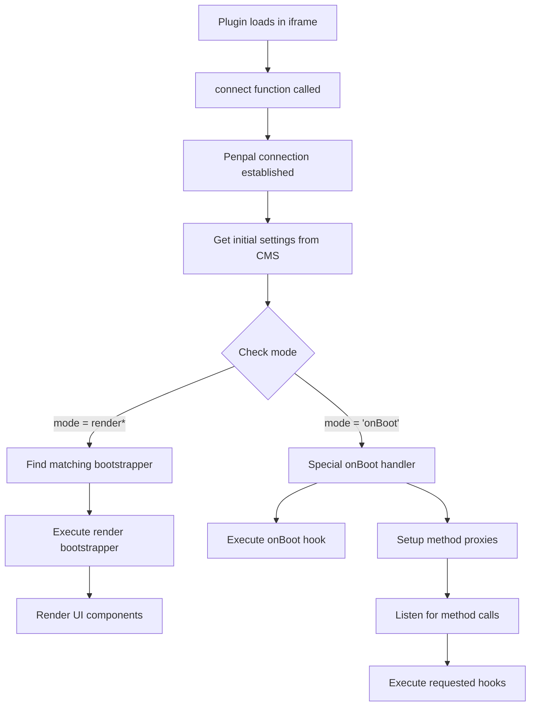

# Plugin Lifecycle

This document explains the lifecycle of a DatoCMS plugin, from initialization to execution in various contexts. Understanding the plugin lifecycle is essential for building effective plugins.

## Overview

A DatoCMS plugin operates within iframe containers in the DatoCMS interface. The plugin communicates with the host application through a secure cross-frame messaging protocol powered by [Penpal](https://github.com/Aaronius/penpal).

### Frame Communication Architecture

The plugin SDK uses Penpal for secure, promise-based communication between the plugin iframe and the DatoCMS host application:

1. **Iframe Isolation**: Each plugin runs in its own sandboxed iframe for security
2. **Message Passing**: All communication happens via `postMessage` API
3. **Type Safety**: TypeScript interfaces ensure type-safe method calls
4. **Promise-Based**: All cross-frame calls return promises for async handling

## Plugin Initialization Flow



## Render Modes

DatoCMS plugins operate in different "render modes" depending on where and how they are invoked:

### 1. Boot Mode (`onBoot`)

The special `onBoot` mode runs when the plugin is first loaded in the CMS. It doesn't render any UI but enables other hooks to be called later.

```typescript
// When mode === 'onBoot'
export default connect({
  onBoot(ctx) {
    // Initialize plugin state
    // Register for events
    // Enable other hooks
  }
});
```

In this mode:
- The plugin sets up method proxies for hooks ending with `Ctx`
- Creates listeners for `onChange` events
- Prepares to handle `callMethodMergingBootCtx` calls from the CMS

### 2. Render Modes

All modes starting with `render` are UI-rendering modes:

- `renderConfigScreen` - Plugin configuration page
- `renderFieldExtension` - Custom field editor
- `renderItemFormSidebar` - Item form sidebar
- `renderItemFormSidebarPanel` - Panel within item form sidebar
- `renderItemFormOutlet` - Custom sections in item form
- `renderItemCollectionOutlet` - Custom sections in item lists
- `renderPage` - Full custom pages
- `renderModal` - Modal dialogs
- `renderAssetSource` - Custom asset sources
- `renderUploadSidebar` - Upload/asset sidebar
- `renderUploadSidebarPanel` - Panel within upload sidebar
- `renderManualFieldExtensionConfigScreen` - Field extension configuration

## Bootstrapping Process

The bootstrapping process determines which render function to call based on the current mode:

### 1. Contained Render Mode Bootstrapper

Used for plugins that render within a contained space and can control their height:

```typescript
// From packages/sdk/src/utils.ts
export function containedRenderModeBootstrapper<
  Ctx extends SelfResizingPluginFrameCtx<any, {}, {}>
>(
  mode: ModeForPluginFrameCtx<Ctx>,
  callConfigurationMethod: (
    connectConfiguration: Partial<ExtractRenderHooks<FullConnectParameters>>,
    ctx: Ctx,
  ) => void,
): Bootstrapper<Ctx['mode']> {
  const bootstrapper: Bootstrapper<Ctx['mode']> = (
    connectConfiguration,
    methods,
    initialProperties,
  ) => {
    if (initialProperties.mode !== mode) {
      return undefined;
    }

    const sizingUtilities = buildSizingUtilities(methods);

    const render = (properties: Record<string, unknown>) => {
      callConfigurationMethod(connectConfiguration, {
        ...methods,
        ...properties,
        ...sizingUtilities,
      } as unknown as Ctx);
    };

    render(initialProperties);

    return render;
  };

  bootstrapper.mode = mode;

  return bootstrapper;
}
```

Features:
- Provides sizing utilities (`startAutoResizer`, `stopAutoResizer`, `updateHeight`)
- Automatically adjusts iframe height based on content
- Used by most render modes

### 2. Full Screen Render Mode Bootstrapper

Used for plugins that take up the full available space:

```typescript
// From packages/sdk/src/utils.ts
export function fullScreenRenderModeBootstrapper<
  Ctx extends ImposedSizePluginFrameCtx<any, {}, {}>
>(
  mode: ModeForPluginFrameCtx<Ctx>,
  callConfigurationMethod: (
    connectConfiguration: Partial<ExtractRenderHooks<FullConnectParameters>>,
    ctx: Ctx,
  ) => void,
): Bootstrapper<Ctx['mode']> {
  const bootstrapper: Bootstrapper<Ctx['mode']> = (
    connectConfiguration,
    methods,
    initialProperties,
  ) => {
    if (initialProperties.mode !== mode) {
      return undefined;
    }

    const render = (properties: Record<string, unknown>) => {
      callConfigurationMethod(connectConfiguration, {
        ...methods,
        ...properties,
      } as unknown as Ctx);
    };

    render(initialProperties);

    return render;
  };

  bootstrapper.mode = mode;

  return bootstrapper;
}
```

Features:
- No sizing utilities (size is imposed by container)
- Used by `renderPage` and other full-screen modes

## Hook Execution in onBoot Mode

When operating in `onBoot` mode, the plugin doesn't render UI but can execute other hooks when requested by the CMS:

```typescript
// Method proxy creation for hooks in onBoot mode
callMethodMergingBootCtxExecutor = (
  methodName: string,
  methodArgs: unknown[],
  extraCtxProperties: Record<string, unknown>,
  extraCtxMethodKeys: string[],
  methodCallId: string,
) => {
  if (!(methodName in configuration)) {
    return undefined;
  }

  return (configuration as any)[methodName](...methodArgs, {
    ...omit(methods, ['getSettings', 'setHeight']),
    ...omit(currentProperties, ['mode', 'bodyPadding']),
    ...Object.fromEntries(
      extraCtxMethodKeys.map((methodName) => [
        methodName,
        function createAdditionalMethodProxy(...args: any[]) {
          return (methods as any).callAdditionalCtxMethod(
            methodCallId,
            methodName,
            args,
          );
        },
      ]),
    ),
    ...extraCtxProperties,
  });
};
```

This enables hooks like:
- `fieldDropdownActions`
- `itemFormDropdownActions`
- `executeFieldDropdownAction`
- `onBeforeItemUpsert`
- And many others

## Example: Complete Plugin Lifecycle

```typescript
import { connect, Ctx } from 'datocms-plugin-sdk';

// Plugin entry point
export default connect({
  // Boot phase - runs first
  onBoot(ctx) {
    console.log('Plugin initialized');
    // This enables other hooks to be called
  },

  // Render phase - when CMS needs field extension UI
  renderFieldExtension(fieldExtensionId, ctx) {
    // Check which extension to render
    if (fieldExtensionId === 'myCustomField') {
      // Render the field UI
      const container = document.getElementById('root');
      
      // Start auto-resizing
      ctx.startAutoResizer();
      
      // Render your component
      // React example:
      // ReactDOM.render(<MyField ctx={ctx} />, container);
    }
  },

  // Hook phase - called from onBoot context
  async fieldDropdownActions(field, ctx) {
    // Return actions for field dropdown
    return [
      {
        id: 'custom-action',
        label: 'My Custom Action',
        icon: 'pencil',
      }
    ];
  },

  // Hook phase - execute the action
  async executeFieldDropdownAction(actionId, ctx) {
    if (actionId === 'custom-action') {
      // Perform the action
      await ctx.notice('Action executed!');
    }
  }
});
```

## Frame Communication Protocol Details

### Message Flow

The SDK handles all the complexity of cross-frame communication, but understanding the flow helps with debugging:

```typescript
// 1. Plugin sends a method call
ctx.setFieldValue('title', 'New Value');
// ↓
// 2. SDK wraps in Penpal message
{ 
  type: 'method-call',
  method: 'setFieldValue',
  args: ['title', 'New Value'],
  id: 'call-123'
}
// ↓
// 3. PostMessage to parent frame
window.parent.postMessage(message, '*');
// ↓
// 4. DatoCMS receives and processes
// ↓
// 5. DatoCMS sends response
{
  type: 'method-response',
  id: 'call-123',
  result: undefined
}
// ↓
// 6. Promise resolves in plugin
```

### Security Considerations

1. **Origin Validation**: Penpal validates message origins
2. **Structured Cloning**: Only serializable data can cross frames
3. **No Direct DOM Access**: Plugins cannot access parent DOM
4. **Sandboxed Execution**: Plugins run with restricted permissions

### Communication Patterns

#### 1. Plugin → CMS (Method Calls)

```typescript
// Synchronous-style API (actually async under the hood)
await ctx.setFieldValue('field', 'value');
await ctx.navigateTo('/content');
await ctx.openModal({ id: 'myModal' });
```

#### 2. CMS → Plugin (Event Notifications)

```typescript
// The CMS can trigger plugin methods
// Example: onChange events that re-render components
connect({
  renderFieldExtension(fieldExtensionId, ctx) {
    // Initial render
    render(<MyComponent ctx={ctx} />);
    
    // CMS can trigger re-renders by calling this again
    // with updated ctx when form values change
  }
});
```

#### 3. Method Proxying (onBoot Mode)

```typescript
// In onBoot mode, the plugin sets up proxies
// CMS calls: plugin.fieldDropdownActions(field, ctx)
// Plugin receives: proxied call with merged context
```

### Performance Implications

1. **Async Overhead**: All cross-frame calls have latency
2. **Serialization Cost**: Large objects take time to serialize
3. **Message Queue**: Rapid calls may queue up

```typescript
// ❌ Avoid rapid cross-frame calls
for (let i = 0; i < 100; i++) {
  await ctx.setFieldValue(`field${i}`, i); // 100 async calls!
}

// ✅ Batch operations when possible
const updates = {};
for (let i = 0; i < 100; i++) {
  updates[`field${i}`] = i;
}
await ctx.setFieldValue('allFields', updates); // 1 async call
```

## Best Practices

1. **Always implement onBoot**: Even if empty, it enables other hooks
2. **Use appropriate bootstrapper**: Contained for most cases, full-screen for pages
3. **Handle errors gracefully**: Plugins run in isolated iframes
4. **Clean up resources**: Stop auto-resizers when components unmount
5. **Check mode before rendering**: Ensure you're in the expected render mode
6. **Minimize cross-frame calls**: Batch operations when possible
7. **Handle async nature**: All ctx methods return promises
8. **Test frame communication**: Use browser DevTools to monitor postMessage